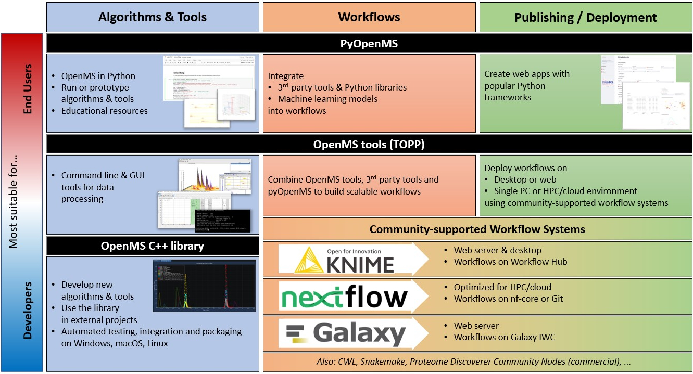

About OpenMS
============

What is OpenMS
--------------

`OpenMS <http://www.openms.org/>`_ is a free, open-source framework based on a C++ library with Python bindings. It is commonly used for liquid
chromatography-mass spectrometry (:term:`LC-MS`) data management and analyses. OpenMS provides an infrastructure for the rapid
development of mass spectrometry related software as well as a rich toolset built on top of it. OpenMS is available
under the `three clause BSD licence <https://github.com/OpenMS/OpenMS/blob/develop/LICENSE>`_ and runs under Windows, macOS, and Linux operating systems.

OpenMS developers can create new C++ algorithms and tools, while users can execute tools or implement new algorithms or scripts in Python.
Workflows integrate pyOpenMS scripts and OpenMS tools with third-party tools and external Python libraries to create scalable data-processing pipelines.
For deployment, users can use pyOpenMS with web frameworks or deploy workflows on desktop, high-performance computing (HPC) or cloud infrastructure using one of the community-supported workflow systems.

OpenMS supports the Proteomics Standard Initiative (PSI) formats for MS data. The main contributors of OpenMS are
currently the Eberhard-Karls-Universität in Tübingen, the Freie Universität
Berlin, and the University of Toronto.

Get involved
------------
OpenMS is developed by a group of `core developers <https://openms.de/contributors/>`_ and the community. You can help spreading the idea of open source mass spectrometry analysis by:

* Contribute to the development by giving us your feedback about the OpenMS project on `Discord <https://discord.gg/aJyWqf6uCn>`_ or become active by `developing new tools yourself </manual/develop>`_.
* Donate to the OpenMS project using our `opencollective <https://opencollective.com/openms>`_ account. All donations will be used strictly to fund the development of Openms’s open source software, documentation, and community.
* Promote OpenMS either online (`e.g. on X <https://x.com/OpenMSTeam?t=aOoFOQ3nQg3vIOTTQfBBqw&s=33>`_) or in your work group.

.. toctree::
    :maxdepth: 1
    :caption: About
    :hidden:

    about/installation.md
    about/communication.md
    about/learning/background.md

.. toctree::
    :maxdepth: 1
    :caption: Getting Started
    :hidden:

    getting-started/introduction.rst
    getting-started/webapps.md
    getting-started/workflows.md
    getting-started/visualize-with-openms.md
    getting-started/topp-tools.md
    pyOpenMS <https://pyopenms.readthedocs.io/en/latest/>

.. toctree::
    :maxdepth: 1
    :caption: Manual
    :hidden:

    manual/contribute.md
    manual/develop.md
    manual/additional.md
    API Reference <https://abibuilder.cs.uni-tuebingen.de/archive/openms/Documentation/nightly/html/TOPP_documentation.html>
    manual/glossary.md

.. toctree::
    :maxdepth: 1
    :caption: Tutorials
    :hidden:

    tutorials/knime-user-tutorial.rst
    tutorials/toppview-user-tutorial.md

